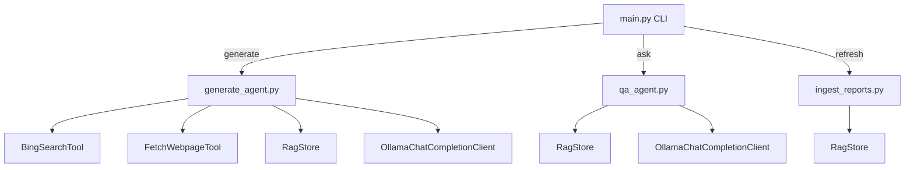

# LEGACY 

# SKMS AATIS Module
Agentic Assistance for Testing Information Systems
Smart Knowledge Management System 0.0.1

> Fully Local & Privacy Friendly, (only outbound is websearches via Bing Web Search API)

See issues page for current known issues.

A single Python-based CLI tool to:

1. **generate**: Search the web and RAG store, summarize results into a timestamped markdown report.
2. **ask**: Run a RAG-powered Question & Answer session over your previously saved reports.
3. **refresh**: Ingest all markdown (`.md`) reports into a FAISS vector store for future queries.

This tool utilizes AutoGen 0.6.1, the Bing Web Search API (search engine), Ollama (language model), and FAISS (vector database).

---


## Prerequisites

- Python 3.8 or newer
- Git
- **Bing Search API Key**: Set the `BING_SEARCH_API_KEY` environment variable to your Bing Search API key.
- **Bing Search Endpoint (optional)**: Set the `BING_SEARCH_ENDPOINT` environment variable (default: `https://api.bing.microsoft.com/v7.0/search`).
- Running Ollama server (default URL: `http://localhost:11434`)

---

## Quickstart Guide

### Step 1: Clone the Repository

```bash
git clone https://your.repo.url/project.git
cd project
```

### Step 2: Setup Virtual Environment

Linux/macOS:
```bash
python3 -m venv .venv
source .venv/bin/activate
```

Windows:
```bash
python -m venv .venv
.venv\Scriptsctivate
```

### Step 3: Install Dependencies

```bash
pip install --upgrade pip
pip install autogen-agentchat==0.6.1 "autogen-ext[ollama]" requests beautifulsoup4 sentence-transformers faiss-cpu
```

### Step 4: Create Initialization Files

```bash
touch tools/__init__.py agents/__init__.py rag/__init__.py
```

### Step 5: Configure Ollama Client

Edit the file `config/ollama_config.json`:

```json
{
  "model": "llama3",
  "base_url": "http://localhost:11434"
}
```

---

## Usage Instructions

### Generate a New Report

This command searches the web, summarizes findings using Ollama, and saves the output as a timestamped markdown file:

```bash
python main.py generate "quantum computing breakthroughs"
```

### Refresh RAG Database

Ingest all existing markdown reports into the FAISS database:

```bash
python main.py refresh
```

### Ask a Question

Use this to query your RAG database and model knowledge:

```bash
python main.py ask "What did we learn about quantum entanglement?"
```

---

## Configuration Options

- **Bing Search API**: Provide your API key via the `BING_SEARCH_API_KEY` environment variable and optionally override the endpoint with `BING_SEARCH_ENDPOINT`.
- **Ollama model settings**: Adjust in `config/ollama_config.json`.
- **Embedding model**: Set in `rag/rag_store.py` (default is `all-MiniLM-L6-v2`).

---

## Troubleshooting Common Issues

- Connection errors to the Bing Search API or Ollama: Ensure your API key is valid, environment variables are set, and endpoints are correct.
- No reports found during refresh: Confirm that you have run the `generate` command at least once.
- FAISS errors: Check file permissions or delete and regenerate the `rag/index.faiss` file.

---

You are now ready to use the Unified RAG & Research CLI tool.
